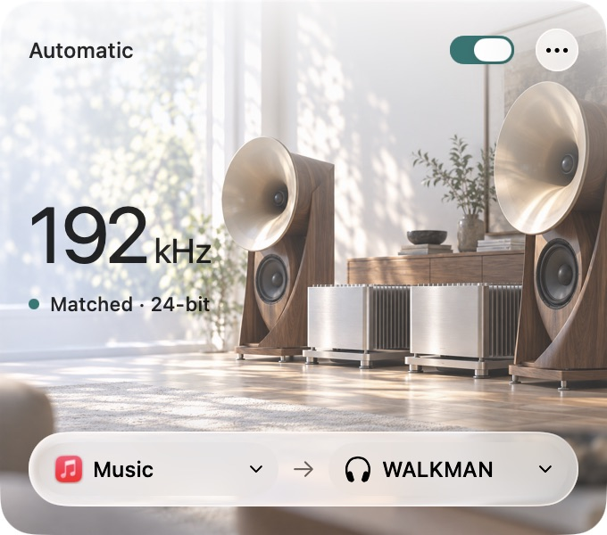

# filo

**Less setup. More listening.**

A free, open-source menu bar companion for your Mac and DAC.
Keep listening in Apple Music while filo matches your output to the formats it can identify.
Spend less time in Audio MIDI Setup.

**[Download for Mac](https://github.com/Audiofool934/filo/releases/latest/download/filo-macos-universal.dmg)** · [Installation](docs/INSTALL.md) · [简体中文](README.zh-CN.md)

macOS 14.4+ · Apple Silicon & Intel · MIT license

> The 1.1.2 DMG and ZIP are Developer ID signed and Apple-notarized.
> Read the [first-launch instructions](docs/INSTALL.md#first-launch) before installing.

<p align="center">
  
</p>

## Made for listening

- **Follow your music:** match supported sample rates and known integer bit depths when Apple Music's playing format can be identified.
- **Keep it simple:** choose your player and DAC, then turn on one switch.
- **Stay out of the way:** a small ƒ in the menu bar opens a fixed-size, arrowless card.
- **Enjoy the details:** native Liquid Glass on macOS 26, with listening scenes for CD, studio, and hi-fi rates.

The scenes are a little listening-room atmosphere, not sound-quality ratings.
Earlier macOS versions use native material fallbacks.

## Player support

| Player | What filo does |
| --- | --- |
| Apple Music | Automatically matches supported formats from available lossless decoder observations or accessible local files. |
| Spotify | Offers a fixed 44.1 kHz music profile and manual rates; it does not detect each track's source format. |

When the source is unknown or its rate is unsupported, filo keeps the current output rate.
If an exact integer bit depth is unavailable, it uses a supported format with sufficient precision when possible and reports limitations.

## Start listening

1. [Download the DMG](https://github.com/Audiofool934/filo/releases/latest/download/filo-macos-universal.dmg), open it, and drag **filo** to **Applications**.
2. Connect your USB DAC and enable its USB DAC mode if it has one.
3. Open filo, click **ƒ**, and select **Apple Music** and your output.
4. Turn on **Automatic**, allow playback access if macOS asks, and start a lossless track in Music.

For Spotify, choose **Spotify profile** for its fixed 44.1 kHz target.
The default Format matching path needs no extra audio driver or recording permission.

Connecting selects your DAC as the Mac's default media output.
Disconnecting restores settings filo still owns; changes you make elsewhere take priority.
Reconnect after sleep or unplugging your DAC.

[Installation and first launch](docs/INSTALL.md) · [Full usage guide](docs/USAGE.md) · [Release notes and checksums](https://github.com/Audiofool934/filo/releases/latest)

## A clear view of your output

**Matched** means the output rate matches the source evidence filo has observed.
It does not certify end-to-end bit-perfect playback or an audible improvement.
Detection can be late or unavailable, and changing a DAC's rate can briefly interrupt playback.

filo is free, has no accounts or telemetry, and does not upload audio.
The default path manages device settings while your player handles playback.
It leaves your player's volume, EQ, and other effects under your control.

Optional Direct relay and Exclusive preview paths live in Settings.
They are experimental features with separate permissions and dependencies; see the [usage guide](docs/USAGE.md#audio-paths).

## How does it work with your DAC?

[Share feedback or report an issue](https://github.com/Audiofool934/filo/issues/new/choose) with your macOS version, player, DAC model, and what happened.
If useful, **••• → Connection details → Copy diagnostics** provides a summary you can review before posting.
You do not need to upload any music.

## Build and explore

Build with Xcode 26 or later, or Command Line Tools with the macOS 26 SDK:

```sh
git clone https://github.com/Audiofool934/filo.git
cd filo
bash scripts/build.sh
open dist/filo.app
```

Swift, SwiftUI/AppKit, CoreAudio, and a small C audio bridge, with no third-party package dependencies.
The universal DMG and ZIP package script is `bash scripts/package-release.sh`; packaging also needs Python 3.10+.
See [Distribution](docs/DISTRIBUTION.md) for Developer ID signing and notarization.

[Contributing](CONTRIBUTING.md) · [Matching behavior](docs/CORE-FORMAT-MATCHING.md) · [Validation](docs/VALIDATION.md) · [Technical notes and audio laboratory](docs/TECHNICAL-NOTES.md)

## License and acknowledgments

[MIT](LICENSE).
The implementation is original and uses public CoreAudio APIs.
[LosslessSwitcher](https://github.com/vincentneo/LosslessSwitcher) and [Choritsu](https://github.com/jcongaku/apple-music-lossless-eq) informed the feasibility research; their source code is not bundled in filo.
The name comes from the Italian word for “thread”.
